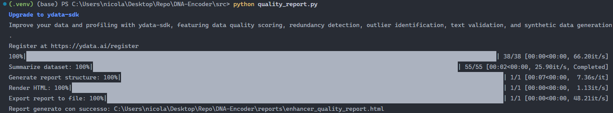

# DNA-Encoder
Progetto per l'esame di AI-Bionformatics dell'università UNIMORE. Implementazione di un modello per la classificazione e il riconoscimento di "promoters, enhancers and introns". L'bbiettivo del progetto è quello di applicare diversi modelli presi dalla letteratura e comparare i risultati con il modello scritto da zero

## Table of contents
- [DNA-Encoder](#dna-encoder)
	- [Table of contents](#table-of-contents)
	- [Getting started](#getting-started)
		- [Datasets](#datasets)
		- [Preprocessing](#preprocessing)
	- [Data qualitity](#data-qualitity)
	- [License](#license)
	- [Author](#author)

## Getting started

### Datasets
Prima di poter eseguire il programma bisogna scaricare 3 dataset:
- [Promoters](https://epd.expasy.org/epd/)
- [Enhancers](https://bio.liclab.net/ENdb/Download.php)
- [Introns](https://www.gencodegenes.org/human/)

Questi 3 file andranno inseriti dentro la cartella `data/raw/`, divisi per categoria:

- `data/raw/enhancer`
- `data/raw/promoters`
- `data/raw/introns`

### Preprocessing
Una volta scaricati i dataset, bisogna effettuare il preprocessing per la pulizia dei dati. Per ogni dataset esiste un file python da eseguire:
- `promoter_cleaning.py`
- `enhancer_cleaning.py`
- `intron_cleaning.py`

Eseguendo questi file si genereranno dei file .parquet dentro la cartella `data/processed/<dataset>/`, con al posto di \<dataset> il nome "enhancer", "promoter" oppure "intron"

## Data qualitity
Per poter verificare la qualità dei dataset basta eseguire il file python `quality_report.py`, che si trova nella cartella `src/`

	$ python ./src/quality_report.py

L'output che dovrebbe generare il comando è:

Questo comando salva il file di report dentro la cartella `reports`

## License
[Click here](./LICENSE)

## Author
- [Nicola Guerra](https://github.com/Ng2k)